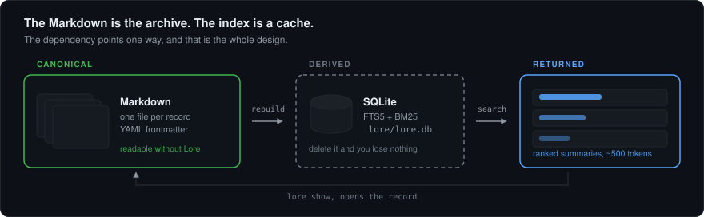
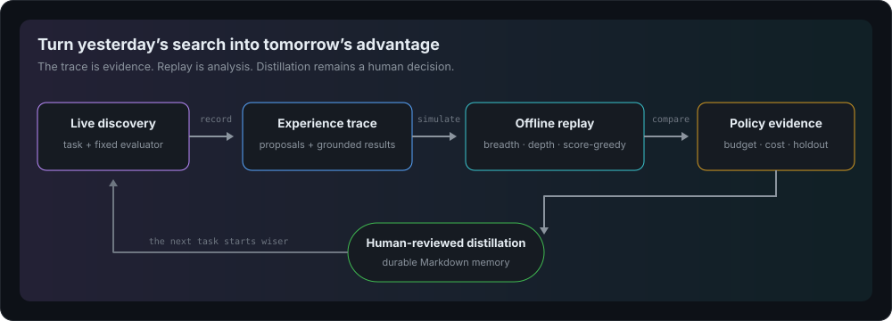
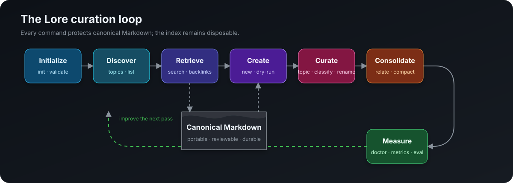
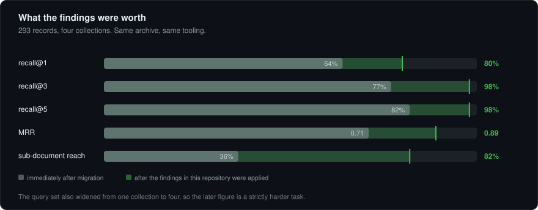
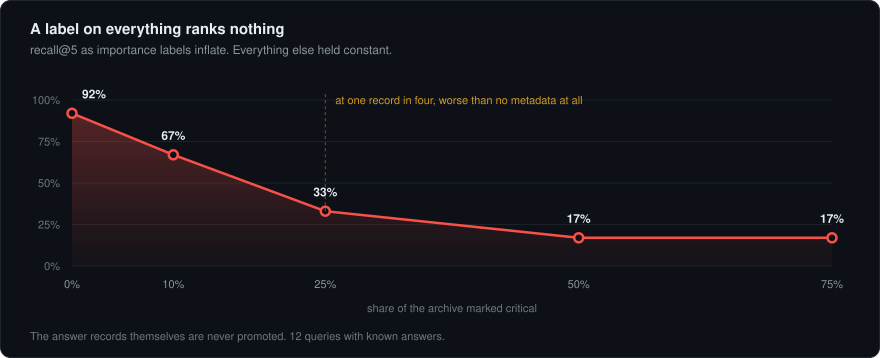
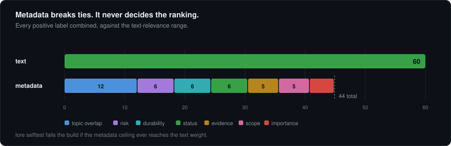
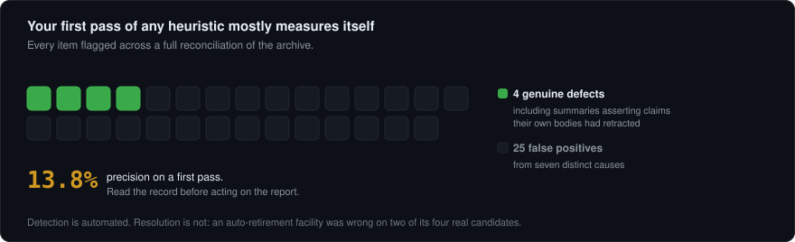
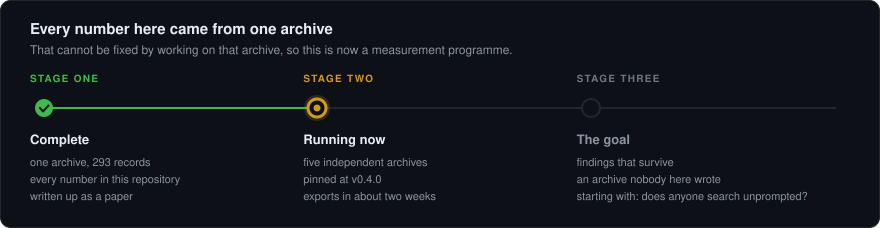

<div align="center">

# Lore

### Your code remembers what survived. Lore remembers why.

**A local-first memory and experience layer for coding agents.**

[](https://github.com/IotA-asce/lore)
[](LICENSE)
[](tools/lore/requirements.txt)
[](#what-lore-promises)
[](#two-kinds-of-memory)

*Keep the scar tissue. Preserve the reasoning. Replay the search.*

</div>



An engineering session leaves behind more than a diff. It leaves the constraint
that nearly broke production, the approach that failed for a non-obvious reason,
and the tiny piece of context that made the final solution possible. Most tools
preserve the result. Lore preserves the expensive part of getting there.

```bash
lore search "why did the consumer test pass without running"
lore show a-green-test-that-never-ran
```

Lore stores durable knowledge as ordinary Markdown, indexes it locally with
SQLite FTS5, and records structured discovery runs that can be replayed without
rerunning an agent or evaluator. Delete `.lore/`; the source survives.

> The point is not to remember everything. It is to stop paying twice for what
> mattered.

## Why Lore exists

Agents work inside bounded sessions. When the window closes, the most valuable
context is often the least likely to appear in code: rationale, rejected paths,
operational hazards, and exceptions to the obvious rule.

| If you need to know… | Look in… |
|---|---|
| What changed? | Git, CI, tickets |
| How does it work now? | Current documentation |
| What am I doing right now? | Temporary task state |
| **What is dangerous or expensive to rediscover?** | **Lore** |

Routine work should leave no Lore record. If code, tests, Git, or current docs
already preserve a fact cheaply, they will usually keep it current better. Lore
is for the knowledge that would otherwise disappear between sessions.

## Start in five minutes

Lore needs Python 3.10+, SQLite (included with Python), and PyYAML.

```bash
git clone https://github.com/IotA-asce/lore.git
cd lore
python3 -m pip install -r tools/lore/requirements.txt
python3 tools/lore/lore.py init ~/knowledge
python3 tools/install.py ~/knowledge
```

Open a new terminal, look around, and make the first memory:

```bash
lore stats
lore collections
lore topics

lore new \
  --id config-replacement-semantics \
  --title "Config files replace instead of merge" \
  --type constraint \
  --importance high \
  --topics "configuration,deployment"

lore search "why did one new setting remove the old ones"
```

`lore init PATH` refuses to overwrite an existing `memory/` directory. Lore
needs no administrator access, server, account, or network connection. See
[INSTALL.md](INSTALL.md) for PATH setup, Windows, manual installation, and
uninstalling.

## Two kinds of memory

Lore separates what happened from what deserves to endure.

```text
workspace/
├── memory/                  durable, reviewed Markdown
│   ├── constraints/
│   ├── decisions/
│   └── lessons/
├── experience/runs/         immutable discovery trees
│   └── planner-v1.json
└── .lore/                   disposable local machinery
    ├── lore.db
    └── retrieval.jsonl
```

**Durable memory** is the compact, reviewed truth future work should retrieve.
**Experience** is the larger tree of proposals, evaluations, costs, and outcomes
that lets Lore study *how* the answer was found. They meet only when a human
chooses to distill an evaluated result.



The editable source is
[docs/diagrams/replay-loop.drawio](docs/diagrams/replay-loop.drawio).

## The everyday loop



1. **Discover** the collections, topics, and lifecycle states already present.
2. **Retrieve** ranked summaries before doing non-trivial work.
3. **Create** only when a finding would be expensive to rediscover.
4. **Curate** identity, taxonomy, classification, and relationships.
5. **Consolidate** prepared knowledge without silently merging prose.
6. **Measure** findability and archive health, then repeat.

The source Markdown is always canonical. SQLite is only the lens that makes it
fast to search.

### Search before solving

```bash
lore search "gateway retries"
lore search "gateway retries" --type decision --importance high
lore search "old authentication" --status superseded
lore search "gateway retries" --topic "API Gateway" --json
lore show gateway-retry-policy --json
lore backlinks gateway-retry-policy
```

Search returns summaries first so an agent can decide what deserves context.
Type, topic, collection, status, and importance filters run before ranking.
`backlinks` exposes typed incoming and outgoing relations.

### Write for the future question

```bash
lore new \
  --id producer-partition-key \
  --title "Producer must set a partition key" \
  --type constraint \
  --importance critical \
  --risk critical \
  --durability invariant \
  --evidence verified \
  --topics "kafka,partitioning"

lore new --title "Preview me" --type lesson --importance normal --dry-run
```

The summary is the primary retrieval surface. Name the surprise, the consequence,
and the action. Do not write a diary entry. The measured guidance lives in
[WRITING_RECORDS.md](WRITING_RECORDS.md).

### Keep truth alive

```bash
lore topic producer-partition-key --add reliability
lore classify producer-partition-key --importance high --evidence verified
lore rename producer-partition-key kafka-producer-partition-key
lore relate checkout-timeout caused_by gateway-retry-policy
lore supersede old-cache-model --by current-cache-model

lore compact --into current-auth-model \
  old-auth-model legacy-auth-notes --dry-run --json
```

Compaction never invents a synthesis. Prepare the target record first; Lore then
retires the sources and adds reverse `supersedes` edges atomically. Old truth is
not deleted—it becomes history.

## Replay discovery, not just conclusions

Lore 0.5.0 integrates the history-as-simulator insight from
[Dream-RSI](https://arxiv.org/abs/2609.14858): a grounded search history can be
reused to compare exploration policies offline. Lore adopts the practical idea,
not autonomous self-modification.

```bash
lore run-start --id planner-v1 --task "Tune query planner" \
  --evaluator bench-v2 --policy breadth --workers 4

lore attempt-add planner-v1 --id branch-a --parent root \
  --proposal "Replace nested scan with indexed lookup"

lore attempt-evaluate planner-v1 branch-a --score 81.4 --correct \
  --outcome success --cost 2 --diagnostics-ref results/branch-a.json

lore run-finish planner-v1
lore replay planner-v1 --policy depth --budget 20 --json
lore policy-compare depth score-greedy --incumbent breadth \
  --budget 20 --holdout 1 --evaluator bench-v2
```

A replay policy sees only the prefix it has revealed, never the full future
tree. Breadth, depth, and score-greedy baselines are deterministic. Comparison
keeps the incumbent visible, isolates newer histories as a holdout, and never
rewrites or promotes policy code automatically.

For parallel discovery, share guardrails without forcing every worker down the
same remembered path:

```bash
lore explore-context "query planner selectivity" \
  --workers 4 --history-branches 1 --json
```

Every worker receives critical constraints and invariants. Only selected
branches receive directional decisions and lessons; the others stay free to
explore. After review, close the loop:

```bash
lore run-distill planner-v1 branch-a \
  --title "Indexed lookup avoids nested planner scans" \
  --type lesson --importance high \
  --topics "database,performance" --dry-run
```

Distillation accepts only an evaluated node from a completed run, cites the
canonical trace, and uses the normal collision, validation, and dry-run safety
checks. The human still decides what becomes memory.

## Proof, not vibes

Lore’s published evidence comes from one real archive. That makes the numbers
useful engineering evidence, not a universal benchmark. The disclosure-safe
metrics format exists so independent archives can test whether these findings
travel.

### Observed archive snapshot

These are operational measurements from `METRICS.md`, not controlled benchmark
results.

| Signal | Observed value | What it says |
|---|---:|---|
| Records | **293** across **4** collections | one workspace, several knowledge domains |
| Index rows | **3,751** · 12.8 per record | section indexing exposes secondary findings |
| Record tokens | p50 **2,070** · p90 **5,704** · max **13,439** | the archive contains substantial records |
| Summary length | p50 **335** characters · **0** thin summaries | the retrieval surface is maintained |
| Searches | **47** over **9** active days | real usage, not synthetic query volume |
| Search misses | **6%** | most queries returned at least one candidate |
| Full-record open rate | **22%** | summaries usually prevented unnecessary opens |
| Archive coverage | **31%** | most records had not yet appeared in retrieval logs |
| Critical records | **4 / 293** · 1% | critical remains a scarce signal |

Coverage and open rate describe behavior, not quality. A low open rate may mean
excellent summaries—or weak user engagement. Lore reports the signal and avoids
inventing the story.

### Controlled interventions

The experiments in `LESSONS.md` isolate specific retrieval and curation changes.

| Intervention | Measured effect |
|---|---:|
| Reject metadata blocks masquerading as summaries | **126** records repaired |
| Index meaningful sections, not only whole records | secondary reachability **36% → 82%** |
| Split code identifiers into searchable words | two collections reached **100% recall@1** |
| Rewrite one weak summary | **unfindable → rank 1** |
| Tune the ranker for three rounds | one collection’s recall@1 changed by **0** |
| First-pass conflict detection | **4** genuine defects among **29** flags |



The lesson was not “tune harder.” It was that the shape of the knowledge—good
summaries, searchable identifiers, reachable sections—matters more than another
round of ranking arithmetic.

### Critical cannot mean everything

In a controlled inflation test, recall@5 fell from **92%** with no records marked
critical to **17%** when half the archive carried that label.



That result shaped Lore’s two-pass ranking model: a bounded text-relevance pool
plus an unbounded safety pass for truly critical knowledge. Text relevance can
contribute 60 points; all metadata combined is capped at 44. Metadata breaks
ties between plausible matches—it cannot make an unrelated record win.



Health tools are intentionally advisory. The first conflict detector was right
only four times in 29 flags; automatic “cleanup” would have damaged the archive.



## How retrieval works

```text
Markdown records
      │
      ├── whole-record index
      ├── meaningful ## / ### sections
      └── identifier expansion: totalCost → total · cost · totalCost
      │
      ▼
SQLite FTS5 candidate set
      │
      ├── bounded relevance pass
      └── unbounded critical-safety pass
      │
      ▼
deduplicate by record → score → return summaries
```

Recency has no authority. An old invariant remains authoritative until someone
explicitly resolves, deprecates, or supersedes it. Malformed records are reported
and skipped so one bad note cannot take retrieval offline.

## The CLI, by intent

| Intent | Commands |
|---|---|
| Begin and verify | `init`, `validate`, `rebuild`, `selftest` |
| Discover | `collections`, `topics`, `list`, `stats` |
| Retrieve | `search`, `show`, `backlinks` |
| Create and classify | `new`, `topic`, `classify`, `rename` |
| Connect and retire | `relate`, `unrelate`, `status`, `supersede`, `compact` |
| Record experience | `run-start`, `attempt-add`, `attempt-evaluate`, `run-finish` |
| Inspect and replay | `runs`, `run-show`, `run-validate`, `replay`, `policy-compare` |
| Reuse experience | `explore-context`, `run-distill` |
| Diagnose and measure | `doctor`, `conflicts`, `usage`, `eval`, `metrics`, `obsidian` |

Most agent-facing reads and writes support `--json`; previewable mutations
support `--dry-run`. The complete contract is in
[tools/lore/CLI_SPEC.md](tools/lore/CLI_SPEC.md), and `lore --help` is
authoritative.

## What Lore promises

- **Local-first.** Indexing, retrieval, replay, and curation require no network.
- **Portable.** Markdown and YAML remain readable without Lore.
- **Disposable machinery.** SQLite can always be rebuilt from canonical files.
- **Fail-open reads.** One malformed record does not take healthy memory offline.
- **Fail-closed writes.** Mutations require a valid archive and validate the
  complete result.
- **Rollback protection.** A failed multi-record publication restores every
  original file.
- **Explicit retirement.** Stale knowledge stays inspectable as history.
- **No autonomous promotion.** Replay produces evidence; people choose policy
  and durable memory.
- **Privacy-audited metrics.** Exports exclude titles, ids, paths, summaries,
  queries, topics, and collection names.

Mutation follows one conservative path:

```text
validate archive → resolve ids → build proposed state → publish atomically
                                                        │
                                  failure ───────────────┴──── success
                                     │                           │
                               restore files              rebuild index
```

Lore refuses to mutate an archive that is already invalid.

## Record anatomy

```markdown
---
schema_version: 1
id: config-replacement-semantics
type: constraint
status: current
importance: high
scope: repository
risk: high
durability: long_lived
evidence: verified
topics: [configuration, deployment]
created_at: 2026-09-18T10:00:00+05:30
updated_at: 2026-09-18T10:00:00+05:30
relations:
  depends_on: [deployment-loader]
---

# Config files replace instead of merge

## Summary

Supplying one environment-specific config file replaces the complete base
mapping; it does not merge keys. Restate every required key in the override.

## Knowledge

The loader treats the selected file as the whole configuration source…
```

Stable ids make automation safe. Lifecycle state keeps history without letting
it pollute normal search. Evidence describes how strongly the claim is grounded;
importance describes how costly it is to miss. They are not the same thing.

## Privacy and measurement

Search and show events remain local in `.lore/retrieval.jsonl`. At most one
daily health snapshot is appended to `metrics/daily.jsonl`.

```bash
lore usage
lore metrics --full
lore metrics --export mine.json
```

Exports contain aggregate counts, rates, percentiles, versions, timestamps,
platform, and schema values. Lore audits every string and refuses to export
anything outside the disclosure allowlist. The exact contract is in
[METRICS.md](METRICS.md).



## Repository map

```text
.
├── memory/                    example canonical archive
├── experience/runs/           replayable discovery trees
├── tools/lore/lore.py         CLI, retrieval, and curation engine
├── tools/lore/experience.py   experience schema and replay logic
├── tools/lore/schema.sql      disposable SQLite schema
├── tools/migrate/             import and reconciliation tools
├── agent/                     harness-neutral operating policies
├── docs/img/                  rendered README figures
├── docs/diagrams/             editable draw.io sources
└── tools/verify.py            full project verifier
```

| Read next | Purpose |
|---|---|
| [START_HERE.md](START_HERE.md) | the five-minute operating guide |
| [WRITING_RECORDS.md](WRITING_RECORDS.md) | write records people can find |
| [INSTALL.md](INSTALL.md) | install, configure PATH, and uninstall |
| [MIGRATING_AN_ARCHIVE.md](MIGRATING_AN_ARCHIVE.md) | adopt Lore in phases |
| [RECONCILING_AN_EXISTING_ARCHIVE.md](RECONCILING_AN_EXISTING_ARCHIVE.md) | resolve imported contradictions |
| [memory/SCHEMA.md](memory/SCHEMA.md) | canonical record schema |
| [LESSONS.md](LESSONS.md) | the experiments and what they taught |

## Development

```bash
python3 -B tools/verify.py
python3 -B tools/verify.py --clean-checkout
```

The verifier parses every Python file as Python 3.10, runs unit, migration,
installer, and end-to-end suites, then executes ranking invariants. Clean
checkout mode applies the working patch to a temporary clone without stashing
or resetting the current tree.

## Honest limits

- Retrieval only helps when someone searches. Give agents a real trigger:
  search before non-trivial work and whenever a surprise feels familiar.
- Replay evaluates policies against recorded trees; it does not execute unseen
  proposals or prove a policy will generalize to a new task.
- Compaction does not synthesize prose. The target must already contain the
  intended canonical knowledge.
- Published measurements come from one archive. They are transparent findings,
  not claims of universal performance.
- Lifecycle commands preserve semantic YAML data but may normalize frontmatter
  formatting when rewriting a record.

<div align="center">

### Build the thing. Keep the reason.

MIT licensed. Local by design. Made for the next mind that opens the repo.

</div>
