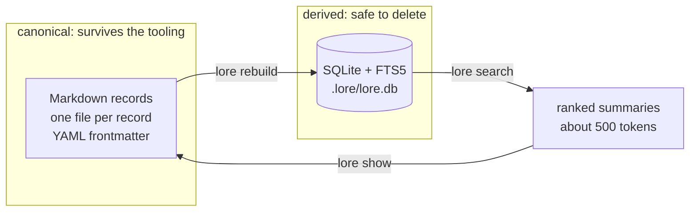
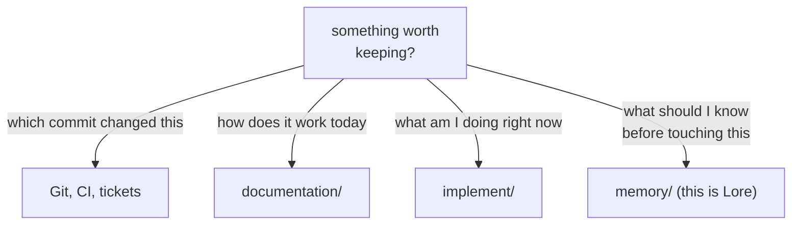
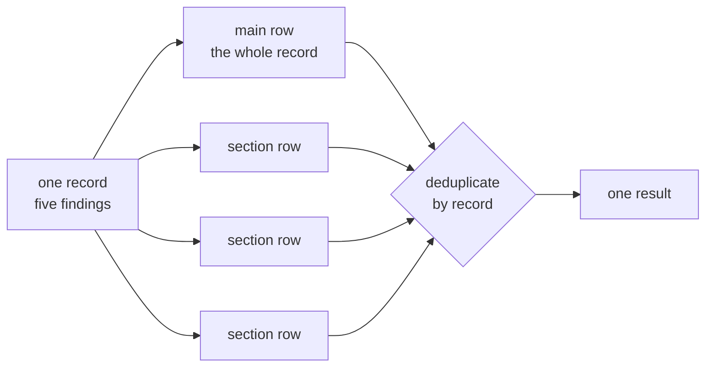
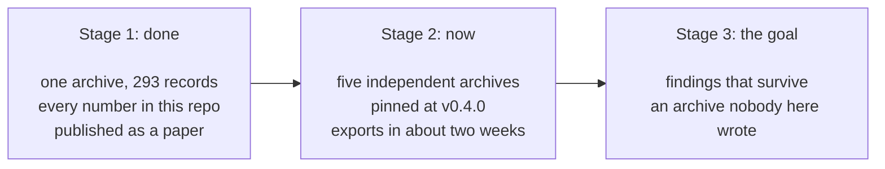
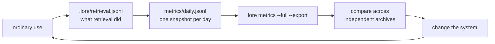

# Lore

**Durable engineering memory for coding agents.** Measured, not asserted.

Lore is what a team knows about a system that never made it into the
documentation: the constraint nobody wrote down, the approach that looks
obvious and fails, the reason something surprising is the way it is.

It is expensive to acquire, and it is normally lost when the session ends.


That is the problem. An agent pays full price for the same discovery every
time, because nothing carried it across the boundary.

---

## What Lore actually is

Markdown files, plus a search tool that decides which of them you should see.



The arrow only points one way, and that is the whole architecture. The
Markdown is the archive; the index is a cache. Delete the database and you
lose nothing. Your records stay readable, editable, diffable and reviewable
with ordinary tools, with or without Lore installed.

### What it deliberately does not hold



Only the last one is Lore's. If Git, tests or current documentation already
preserve something cheaply, they will do it better and stay current for free.
**A routine bug fix should produce no record at all.**

---

## The part that took measuring

Everything below was measured on a real archive of 293 records across four
collections, migrated from two memory systems in daily use. Three findings
were counter-intuitive enough that we got them wrong first.

### 1. A label on everything ranks nothing

Curation metadata is added to improve retrieval. Past a low threshold it
destroys it. Holding everything else constant and varying only the share of
records marked `critical`:

| share marked `critical` | 0% | 10% | 25% | 50% |
|---|---|---|---|---|
| **recall@5** | 92% | 67% | 33% | 17% |

At a quarter critical, retrieval is worse than it was with no metadata at all.
The cause was arithmetic, not tuning: `critical` importance plus `critical`
risk plus `invariant` durability summed to exactly the entire text-relevance
range, so a record with those labels and **no textual relevance whatsoever**
tied a record that matched the query perfectly.

So the budget is now structural:

```
   0        10        20        30        40        50        60
   |---------|---------|---------|---------|---------|---------|
   ############################################################   text relevance
   ############################################                   all metadata combined
                                               ^
                        every label there is, added together, still cannot
                        outrank a record that simply matches better
```

`lore selftest` asserts this and **fails the build** if a scoring change
breaks it, because the regression is distributional and therefore invisible to
any single-query test. Damage starts early: with only **four** critical
records out of 293, seven unrelated records were being displaced on queries
about other subjects.

### 2. Retrieval granularity should not dictate how knowledge is filed

Large records were not the problem. Findability by size was 98% for the
smallest records and 94% above 4,000 tokens. But querying a large record by
its *own internal headings* returned it only **36%** of the time: a record is
one indexable unit however many findings it holds, so its fourth finding
competes using the whole document's vocabulary and loses.

The obvious fix, splitting, is wrong. Splitting is irreversible, and the
grouping is information: a record gathering five findings under one
investigation is asserting they belong together.



Index the sections, return the record. Reachability went **36% to 82%** with
no record modified and nothing on disk changed. A main-row match means the
record *is* about the query; a section match means one part of it *mentions*
the query. Both surface the record; only the first wins a close contest.

### 3. How records are written beats how they are ranked

| intervention | effect |
|---|---|
| stop admitting metadata blocks as summaries | 126 records fixed |
| index sections as well as whole records | secondary findings 36% -> 82% |
| split code identifiers into words | two collections to 100% recall@1 |
| rewrite **one** weak summary | that record: unfindable -> rank 1 |
| **three rounds of ranker tuning** | one collection's recall@1: **zero change** |

This is why `WRITING_RECORDS.md` is the document that matters most, and why it
is short.

### 4. Automate detection, never resolution

Across a full reconciliation pass the health checks flagged **29 items
containing 4 real defects**, a precision of 13.8%. An auto-resolution
facility was **wrong on two of its four real candidates**, because a record
can announce that it is stale and still be the only thing that works.

> A wrong detection costs a minute of reading. A wrong resolution costs
> knowledge, silently, and you find out months later when someone confidently
> repeats a mistake you already solved.

---

## What we are doing, and the end goal

Every number above came from **one archive, in one organisation, in one
domain.** That is the honest limit of what is known about Lore, and no amount
of further work on that archive can fix it. Its author cannot forget that it
exists.

So the project is now a measurement programme, not a feature programme.



Lore measures itself so this is possible. Any command appends one anonymous
snapshot per day; an export bundles them into a file safe to hand to a
stranger.



The export carries counts, rates, percentiles and scores. It carries no
titles, ids, paths, summaries, bodies, query text, topic names or collection
names. That is **enforced, not promised**: before writing, every string value
must be a version, a timestamp, a platform name or a schema value, and the
export refuses to write and names the field if not. On a 293-record archive
the bundle held eleven strings in total; everything else was numbers.

### The questions one archive cannot answer

- Does the importance budget hold when the writer is not the person who
  designed the rule?
- Does the zero-result rate fall with archive size, or rise?
- Is the section-match discount right for archives whose records are short?
- What share of records does a healthy archive never retrieve? Nobody knows.
  It might be 70% and fine.
- **Does anything reach for search without being told to?**

The last one decides whether any of this matters. An archive that is never
queried is irrelevant however good its ranking is, and it is precisely the
question a single archive can never answer.

**If you are trying Lore, two weeks of ordinary use and one export is the most
useful thing you can do for it.** Not a clean archive, not a demonstration:
the real one, including the days you forgot it existed.

---

## Quickstart

```bash
python -m pip install -r tools/lore/requirements.txt
python tools/lore/lore.py rebuild
python tools/lore/lore.py search "my consumer test passed but nothing ran"
```

That last command finds a record whose title shares almost no words with the
question. That is the whole product.

Then make it a real command, because the gap between `lore search` and a
forty-character invocation is most of what decides whether anyone searches on
a hunch:

```bash
python tools/install.py /path/to/your/archive
```

```bash
lore search "why did the consumer test pass without running"
lore new --type constraint --importance high --title "..."
lore doctor        # can every record be found by its own subject?
lore conflicts     # does anything contradict itself?
lore metrics       # is this archive earning its keep?
```

---

## Two honest caveats

**Nothing makes anything search.** Retrieval depends on something choosing to
run it. Give your agent a concrete trigger rather than a judgement call:
*search before non-trivial work, and whenever something is surprising or looks
like it has been hit before.* Asking someone to search "when history might
matter" asks them to suspect the trap before looking, and the traps worth
recording are the ones nobody suspects.

**`compact` and `supersede` are not implemented.** Nothing yet stops an
archive accumulating stale records at scale. `validate` catches a half-finished
retirement and `conflicts` finds contradictions, so the manual path works, but
this is the known gap.

---

## Where to go next

| file | what it answers |
|---|---|
| `START_HERE.md` | the five-minute version |
| `WRITING_RECORDS.md` | **read this second**. How to write a record people can find |
| `INSTALL.md` | getting `lore` onto your PATH, and undoing it |
| `RECONCILING_AN_EXISTING_ARCHIVE.md` | merging notes you already have |
| `LESSONS.md` | what building this taught us, and what it cost to learn |
| `METRICS.md` | what is measured, and what is shared |
| `tools/lore/CLI_SPEC.md` | every command, and why it behaves as it does |
| `memory/SCHEMA.md` | the record format |

Lore is tool-agnostic. `AGENTS.md` is the portable entry point; `CLAUDE.md` is
a thin Claude Code adapter. Other harnesses need only the smallest adapter
that makes them discover the canonical rules.

MIT licensed.
