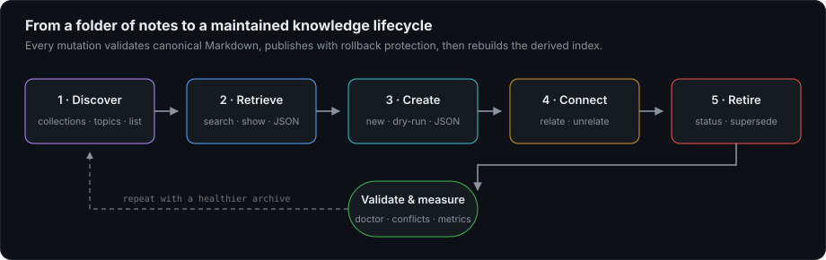
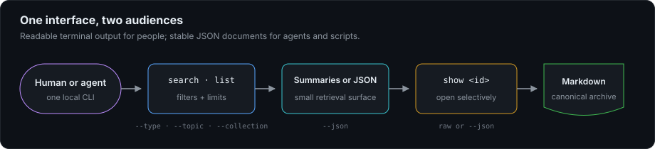
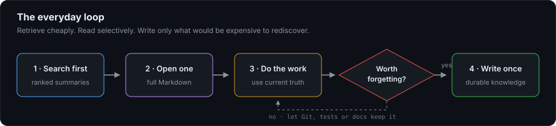
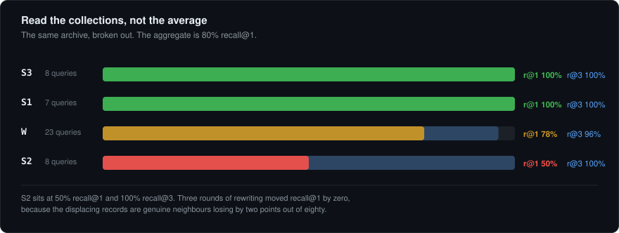

<div align="center">

# Lore

### Durable engineering memory for coding agents

**Discover it. Retrieve it. Curate it. Retire it when truth changes.**

[](https://github.com/IotA-asce/lore)
[](LICENSE)
[](tools/lore/requirements.txt)
[](tools/lore/requirements.txt)
[](#design-guarantees)
[](#architecture)

</div>

Lore is a local-first memory layer for software work. It keeps the constraint
nobody documented, the failed approach worth avoiding, and the reason a
surprising design is correct—then makes that knowledge cheap to retrieve
before the next agent rediscovers it.

```bash
lore search "why did the consumer test pass without running"
lore show a-green-test-that-never-ran
```


Canonical knowledge stays in ordinary Markdown. SQLite FTS5 is only a fast,
disposable index: delete `.lore/lore.db` and Lore rebuilds it from the source
files.

## Why Lore exists

An agent works inside a bounded session. When that session ends, expensive
context disappears: undocumented constraints, rejected approaches, failure
mechanisms, and rationale. Git says *what changed*. Current documentation says
*how the system works now*. Lore answers a different question:

> What is expensive or dangerous to forget before I touch this again?

| Question | Canonical source |
|---|---|
| Which commit changed this? | Git, CI, tickets |
| How does it work today? | Current documentation |
| What am I doing right now? | Temporary task state |
| **What must not be rediscovered?** | **Lore records** |

Routine changes should produce no record. If code, tests, Git, or current docs
preserve a fact cheaply, they will usually keep it current better.

## Start in five minutes

Lore needs Python 3.10+, SQLite (included with Python), and PyYAML.

```bash
git clone https://github.com/IotA-asce/lore.git
cd lore
python3 -m pip install -r tools/lore/requirements.txt
python3 tools/lore/lore.py init ~/knowledge
python3 tools/install.py ~/knowledge
```

Open a new terminal, inspect the archive, and create a record:

```bash
lore stats
lore collections
lore topics

lore new \
  --id config-replacement-semantics \
  --title "Config files replace instead of merge" \
  --type constraint \
  --importance high \
  --topics "configuration,deployment"

lore search "why did one new setting remove the old ones"
```

`lore init PATH` refuses to overwrite an existing `memory/` directory. Nothing
is installed system-wide; no administrator access, server, account, or network
connection is required. See [INSTALL.md](INSTALL.md) for PATH setup, Windows,
manual installation, and uninstalling.

## The complete curation loop


The editable source for this figure is
[docs/diagrams/curation.drawio](docs/diagrams/curation.drawio).

1. **Initialize** an archive and validate its source records.
2. **Discover** collections, topics, metadata, and lifecycle states.
3. **Retrieve** ranked summaries, full records, and graph context.
4. **Create** a record with a generated or stable explicit id.
5. **Curate** taxonomy, classification, identity, and relationships.
6. **Consolidate** prepared knowledge without silently merging prose.
7. **Measure** health and retrieval quality, then improve the next pass.



## Command tour

### Initialize and validate

```bash
lore init ~/knowledge
lore init ~/knowledge --json
lore validate
lore validate --json
lore rebuild --strict
```

Validation checks schema versions, ids, required sections, enum values,
relationships, and supersession integrity. JSON validation preserves exit
semantics while returning counts plus complete error and warning arrays.

### Discover the archive

```bash
lore collections --json
lore topics --collection services/catalog --limit 25
lore list --type constraint --status current
lore list --importance critical --topic deployment --json
```

`collections` exposes exact archive names. `topics` exposes the vocabulary
accepted by exact topic filters. `list` inventories records without inventing
a full-text query; type, topic, status, importance, and collection filters
compose.

### Search, read, and inspect the graph

```bash
lore search "gateway retries"
lore search "gateway retries" --type decision --importance high
lore search "old authentication" --status superseded
lore search "gateway retries" --topic "API Gateway" --json
lore show gateway-retry-policy --json
lore backlinks gateway-retry-policy
lore backlinks gateway-retry-policy --json
```

Search filters run before scoring. `backlinks` reports incoming and outgoing
typed edges with the other record's title and lifecycle state.



### Create deliberately

```bash
lore new \
  --id producer-partition-key \
  --title "Producer must set a partition key" \
  --type constraint \
  --importance critical \
  --risk critical \
  --durability invariant \
  --evidence verified \
  --topics "kafka,partitioning"

lore new --title "Preview me" --type lesson --importance normal --dry-run
lore new --title "Automate me" --type lesson --importance normal --json
```

Explicit ids are portable and automation-friendly. `--dry-run` renders the
exact proposed Markdown without writing. `--json` returns the creation state,
id, path, and collection.

### Curate metadata and identity

```bash
lore topic producer-partition-key --add reliability
lore topic producer-partition-key --remove kafka

lore classify producer-partition-key \
  --importance high \
  --scope subsystem \
  --risk high \
  --durability long_lived \
  --evidence verified

lore rename producer-partition-key kafka-producer-partition-key
```

Topic matching is case-insensitive and space/hyphen aware; Lore refuses to
remove the final topic. `classify` validates every enum. `rename` changes the
canonical id and every incoming relation reference in one transaction while
leaving the filename stable.

### Connect and consolidate

```bash
lore relate checkout-timeout caused_by gateway-retry-policy
lore unrelate checkout-timeout related_to payment-runbook

lore compact --into current-auth-model old-auth-model legacy-auth-notes --dry-run --json
lore compact --into current-auth-model old-auth-model legacy-auth-notes

lore supersede old-cache-model --by current-cache-model
lore status investigation-closed resolved
```

Relationship types are `supersedes`, `depends_on`, `related_to`, `caused_by`,
and `contradicts`. Compaction is intentionally conservative: write the final
canonical prose in the target first; Lore then marks each source `superseded`
and adds reverse `supersedes` edges atomically. It never concatenates or
deletes bodies.

### Maintain and measure

```bash
lore doctor        # findability and summary health
lore conflicts     # possible contradictions and duplicate subjects
lore stats         # archive size and metadata distribution
lore usage         # what real retrieval has done
lore metrics       # privacy-audited health snapshot
lore eval          # retrieval against known answers
lore obsidian      # generated topic navigation
lore selftest      # ranking invariants
```

The complete command contract is in
[tools/lore/CLI_SPEC.md](tools/lore/CLI_SPEC.md). `lore --help` is
authoritative.

## Ten new improvement iterations

This release was improved in ten isolated, validated iterations:

| # | Improvement | Practical outcome |
|---:|---|---|
| 1 | Archive initialization | `init PATH [--json]` creates a safe, empty archive |
| 2 | Stable explicit ids | `new --id` supports durable external references |
| 3 | Search importance filter | Restrict ranking to one importance tier |
| 4 | List importance filter | Audit a tier without a text query |
| 5 | Bidirectional graph inspection | `backlinks` shows incoming and outgoing edges |
| 6 | Atomic id rename | Rename an id and repair all backlinks together |
| 7 | Topic curation | Add or remove taxonomy without hand-editing YAML |
| 8 | Metadata classification | Update importance, scope, risk, durability, and evidence |
| 9 | Conservative compaction | Retire several sources into a prepared target safely |
| 10 | JSON validation | Consume complete validation results programmatically |

These additions extend the lifecycle without changing the record schema,
index schema, ranking constants, or canonical Markdown model.

## Mutation safety

Read commands fail open so one malformed record cannot take retrieval offline.
Write commands take the opposite posture:

```text
validate existing archive
        ↓
resolve canonical ids
        ↓
build the complete proposed state
        ↓
atomically replace file(s)
        ↓
validate the complete archive
   ↙ failure       success ↘
restore originals     rebuild SQLite
```

Lore refuses to mutate an already-invalid archive. A failed multi-record
publication restores every original file before returning an error.

## Record format

```markdown
---
schema_version: 1
id: config-replacement-semantics
type: constraint
status: current
importance: high
scope: repository
risk: high
durability: long_lived
evidence: verified
topics: [configuration, deployment]
created_at: 2026-09-18T10:00:00+05:30
updated_at: 2026-09-18T10:00:00+05:30
relations:
  depends_on: [deployment-loader]
---

# Config files replace instead of merge

## Summary

Supplying one environment-specific config file replaces the complete base
mapping; it does not merge keys. Restate every required key in the override.

## Knowledge

The loader treats the selected file as the whole configuration source...
```

The summary is the primary retrieval surface. Write it for the question a
future stranger will ask, not as a diary. See
[WRITING_RECORDS.md](WRITING_RECORDS.md) for measured guidance.

## Architecture

Lore indexes whole records and meaningful `##`/`###` sections. It expands
code identifiers (`totalCost` becomes `total`, `cost`, and `totalCost`) and
uses two candidate passes: a bounded relevance pool and an unbounded safety
pass for critical knowledge. Results are deduplicated by record after scoring.

Text relevance contributes up to 60 points; all metadata combined contributes
at most 44. Metadata breaks ties between comparable matches—it cannot make an
unrelated record win. Recency contributes nothing, so an old invariant remains
authoritative until explicitly retired.




## Evidence, not intuition

Lore was tuned against a real archive of 293 records across four collections.
Record quality and indexing granularity mattered more than repeated ranker
tuning.


| Intervention | Measured effect |
|---|---:|
| Stop admitting metadata blocks as summaries | 126 records repaired |
| Index sections as well as whole records | secondary-finding reachability 36% → 82% |
| Split code identifiers into words | two collections reached 100% recall@1 |
| Rewrite one weak summary | that record moved from unfindable → rank 1 |
| Three rounds of ranker tuning | one collection's recall@1 changed by 0 |

An archive average can hide a weak collection:



Importance inflation can also destroy ranking signal:


Health tools remain advisory. A first conflict detector flagged 29 items and
only four were genuine defects:


Read a flagged record before changing it. A false detection costs a minute; a
false automatic resolution silently destroys knowledge.

## Privacy and measurement

Commands append at most one daily health snapshot to `metrics/daily.jsonl`.
Search and show events stay local in `.lore/retrieval.jsonl`.

```bash
lore metrics --full
lore metrics --export mine.json
```

Exports contain counts, rates, percentiles, versions, timestamps, platform,
and schema values. They exclude titles, ids, paths, summaries, query text,
topic names, and collection names. Lore audits every string and refuses an
export containing anything outside the disclosure allowlist.


See [METRICS.md](METRICS.md) for the exact disclosure contract.

## Design guarantees

- **Local-first:** indexing, retrieval, and curation require no network.
- **Portable:** Markdown and YAML remain useful without Lore.
- **Disposable index:** SQLite can always be rebuilt from canonical files.
- **Fail-open reads:** malformed records are reported and skipped while valid
  knowledge remains searchable.
- **Fail-closed writes:** mutations require a valid archive and validate the
  complete result.
- **Rollback protection:** failed multi-record publication restores originals.
- **Stable automation:** major read, create, and validation flows offer JSON.
- **Measured invariants:** `lore selftest` guards scoring and retirement rules.

## Repository map

```text
.
├── memory/                    # example canonical archive
├── tools/lore/lore.py         # CLI, retrieval, and curation engine
├── tools/lore/schema.sql      # disposable SQLite schema
├── tools/migrate/             # archive import and reconciliation
├── agent/                     # harness-neutral operating policies
├── docs/img/                  # README-ready SVG figures
├── docs/diagrams/             # editable draw.io sources
└── tools/verify.py            # syntax, unit, integration, invariant checks
```

| Read next | Purpose |
|---|---|
| [START_HERE.md](START_HERE.md) | Five-minute operating guide |
| [WRITING_RECORDS.md](WRITING_RECORDS.md) | Write records people can find |
| [INSTALL.md](INSTALL.md) | Install, configure PATH, and uninstall |
| [MIGRATING_AN_ARCHIVE.md](MIGRATING_AN_ARCHIVE.md) | Adopt Lore in phases |
| [RECONCILING_AN_EXISTING_ARCHIVE.md](RECONCILING_AN_EXISTING_ARCHIVE.md) | Resolve imported contradictions |
| [memory/SCHEMA.md](memory/SCHEMA.md) | Canonical record schema |
| [LESSONS.md](LESSONS.md) | What the project measured and learned |

## Development

```bash
python3 -B tools/verify.py
python3 -B tools/verify.py --clean-checkout
```

The verifier parses every Python file as Python 3.10, runs unit, migration,
installer, and end-to-end suites, then executes ranking self-tests. Clean
checkout mode applies the current patch to a temporary clone without stashing
or resetting the working tree.

## Honest limitations

- Retrieval only helps when a human or agent searches. Give agents a concrete
  trigger: search before non-trivial work and whenever a surprise looks
  familiar.
- Compaction does not synthesize or merge prose. The target must already hold
  the intended canonical knowledge before sources are retired.
- Published measurements come from one archive. Privacy-audited exports exist
  to test whether the findings survive independent archives.
- Lifecycle commands preserve semantic YAML data but may normalize
  frontmatter formatting when they rewrite a record.

<div align="center">

Built to make rediscovery optional—and curation explicit. MIT licensed.

</div>
